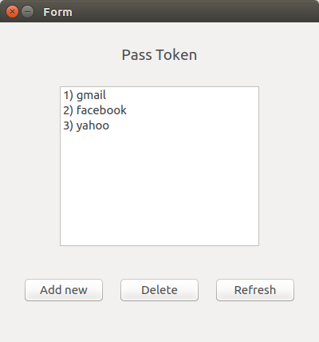
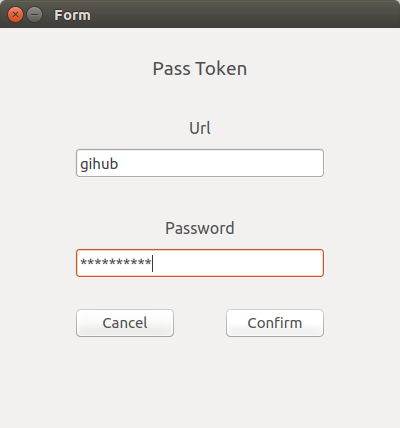
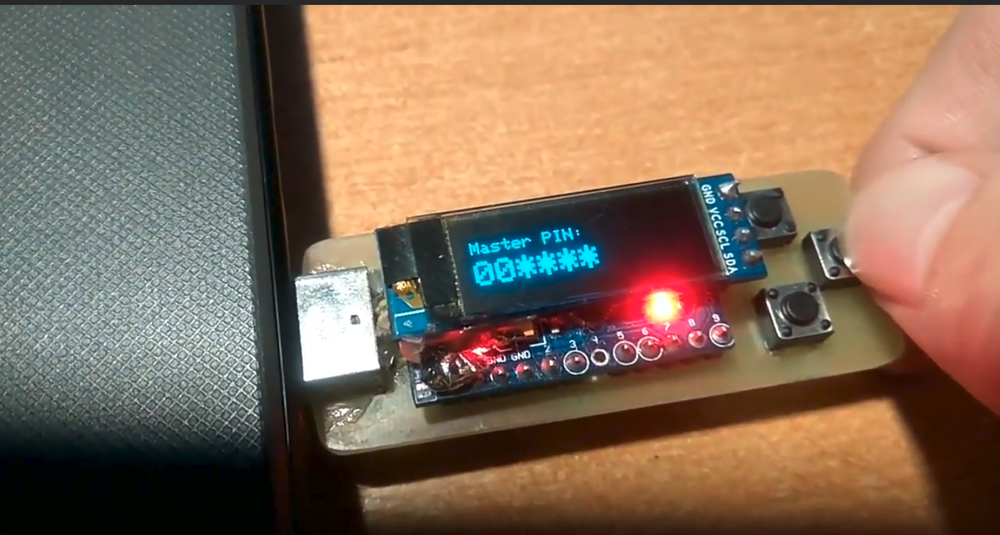

PassToken - портативный менеджер паролей
===================================================================================
Это устройство способно хранить пароли от многих аккаунтов и вводить их вместо Вас. При подключении к компьютеру оно определяется как клавиатура и мгновенно вводит нужный Вам пароль. Это позволяет больше не запоминать все свои пароли/записывать их куда-то.

Использование
-------------
#### Использование токена
Подключите токен к компьютеру. На экране токена появится меню с такими пунктами
  * **Login** - ввод пароля
  * **Sync DB** - режим синхронизации с компьютером
  * **Full Reset** - полный сброс устройства
  * **Change PIN** - смена пин-кода
  * **Turn UI** - поворот изображения на экране на 180 градусов.
  
Для ввода пароля выберите пункт Login. При этом необходимо ввести пин-код. После 5-ти неправильных попыток ввода пин-кода
вся база паролей будет стерта. После авторизации выбираем аккаунт, пароль от которого нужно ввести. После чего наводим устанавливаем курсор в поле ввода пароля и нажимаем кнопку OK на токене. При этом токен переходит в режим имитации клавиатуры и вводит пароль.
#### Синхронизация токена с компьютером
Для обновления базы паролей нужно воспользоваться специальным клиентом. Он лежит в папке driver. Там же детально описан процесс установки. Работа с клиентом проста и интуитивно понятна

#### Видео использования(кликабельно)

